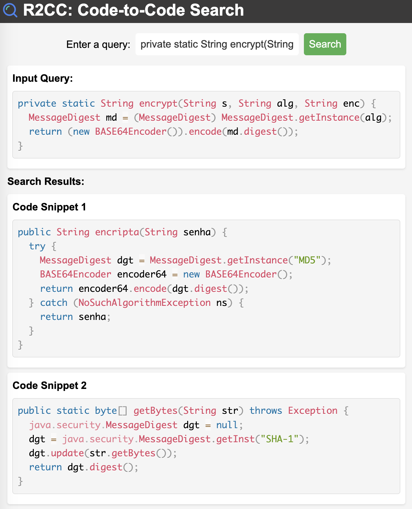

# Code-to-Code Search

## Data Preprocess

To conduct our experiments, we leverage the widely recognized [BigCloneBench](https://github.com/clonebench/BigCloneBench)
, which serves as a benchmark for code clone detection. With its extensive collection of 8 million clone pairs, this dataset provides a
robust basis for our evaluation. we incorporate a dataset of 8,345,104  clone pairs from BigCloneBench. To ensure the quality of  the dataset, we remove duplicate clone pairs, resulting in the  processed dataset.

Data statistic about the cleaned dataset for code-to-code search is shown in this Table.

| Clone Type | T1    | T2    | VST3    | ST3     | MT3      | WT3/T4   | Total    |
|------------|-------|-------|---------|---------|----------|----------|----------|
| Original   | 47146 | 4223  | 13959   | 158760  | 2478766  | 5672385  | 8375239  |
| Cleaned    | 3406  | 1726  | 8977    | 126340  | 616104   | 590825   | 1347378  |

## Dependency 

- pip install torch
- pip install transformers
- pip install tree_sitter

### Tree-sitter (optional)

If the built file "parser/my-languages.so" doesn't work for you, please rebuild as the following command:

```shell
cd parser
bash build.sh
cd ..
```

## Train

We train the model on 4*V100-32G GPUs.
```shell
mkdir -p ./saved_models/java
python run.py \
--output_dir=./saved_models/java \
--config_name=microsoft/graphcodebert-base \
--model_name_or_path=microsoft/graphcodebert-base \
--tokenizer_name=microsoft/graphcodebert-base \
--lang=java \
--do_train \
--do_valid \
--train_data_file=dataset/java/train.jsonl \
--valid_data_file=dataset/java/valid.jsonl \
--test_data_file=dataset/java/test.jsonl \
--num_train_epochs 1 \
--code_length 512 \
--data_flow_length 128 \
--train_batch_size 28 \
--valid_batch_size 28 \
--learning_rate 2e-5 \
--seed 123456 2>&1| tee saved_models/$lang/train.log
```


## Inference and Evaluation
```shell
python run.py \
--output_dir=./saved_models/java \
--config_name=microsoft/graphcodebert-base \
--model_name_or_path=microsoft/graphcodebert-base \
--tokenizer_name=microsoft/graphcodebert-base \
--lang=java \
--do_test \
--test_data_file=dataset/java/test.jsonl \
--num_train_epochs 1 \
--code_length 512 \
--data_flow_length 128 \
--train_batch_size 28 \
--valid_batch_size 28 \
--learning_rate 2e-5 \
--seed 123456 2>&1| tee saved_models/$lang/test.log
```

## Results	

The results on the filtered dataset are shown in this Table:

| Method                        | MRR    | R@1    | R@5    | R@10   | Time/Query (s) |
|-------------------------------|--------|--------|--------|--------|----------------|
| BM25                          | 0.4917 | 0.3432 | 0.6977 | 0.7857 | 0.0571         |
| DeepSim                       | 0.5348 | 0.3974 | 0.7235 | 0.8340 | 2.7945         |
| ASTNN                         | 0.5753 | 0.4265 | 0.7658 | 0.8694 | 2.9311         |
| CodeBERT                      | 0.6721 | 0.5934 | 0.8107 | 0.8998 | 10.0933        |
| Aroma                         | 0.5927 | 0.4355 | 0.8085 | 0.8898 | 5.7425         |
| R2CC (Two-Stage Candidate@100) | 0.7119 | 0.6273 | 0.8359 | 0.8812 | 0.0394         |
| R2CC (Only Dense Embdding)    | 0.7245 | 0.6325 | 0.8553 | 0.9065 | 0.1559         |
| R2CC (Only Hashing)           | 0.4545 | 0.3733 | 0.5596 | 0.6578 | 0.0315         |

## Web Demo of Code-to-Code Search



